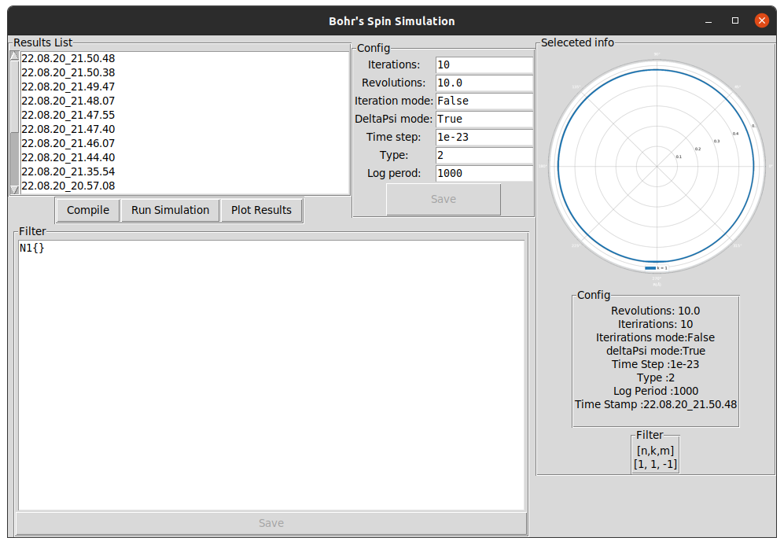

# Bohr's Model Electron Simulation

Bohr's Model Electron Simulation is program for simulationg the movment of an electron
in a given orbit path that is determinant by Bohr constant aka "H bar"

## Installation
Use the terminal to install [Python3](https://www.python.org/ftp/python/3.10.0/python-3.10.0-amd64.exe)

```bash
sudo apt-get install python
```
## Extrnal libraries

Use the package manager [pip](https://pip.pypa.io/en/stable/) to install matplotlib.

```bash
pip install matplotlib
```
## Configuration

To change the settings of the simulation you need to edit the "config.ini" file

```python
# number of the full revelutions to simulate for each orbit (only used when iterationMode = 0 )
revolutions =5
# flag for which mode to run the code according to the value in revolutions (False / 0 ) or the value in itrs (True / 1) 
iterationMode =0
# flag for which mode to only log the itartions on full revelutions 0 log acrroding to logPerod 1 Log once every revelution 
deltaPsiMode =0
# number of itrations to run for each orbit (only used when iterationMode = 1 )
itrs =10000000
# used as the value of the charge of the electron in every equation
charge =4.803E-10
# used as the value of the mass of the electron in every equation
mass =9.109383E-28
# used as the time interval for between each itration
t =1E-21
# the logging for how many itrations to actually store in the results files
logPerod =10000
```
## Filter 

To choose which orbits to simulate you need to edit the "filter.ini" file

input to this file needs to be in this format 
```C
N1{
    K1{
        M0
        M1
    }
}
N2{
    K2{
        M2
    }
}
N3{}
```
Where (0<=N<=9) and for each N (1<=K<=N) and for each K (0<=M<=K)

## Run

Run the python script to plot the results through the terminal 

```bash
make plot
```
## UI

Running the make plot command opens this window


## Contributing
Pull requests are welcome. For major changes, please open an issue first to discuss what you would like to change.
note for each change in any of the .c files there is a need to recompile the code before the changes are applied
compile using the [gcc](https://gcc.gnu.org/) compiler with the use of makefile any added files need to be also added 
to the makefile


```bash
1.make
2.make run
3.make plot
```
